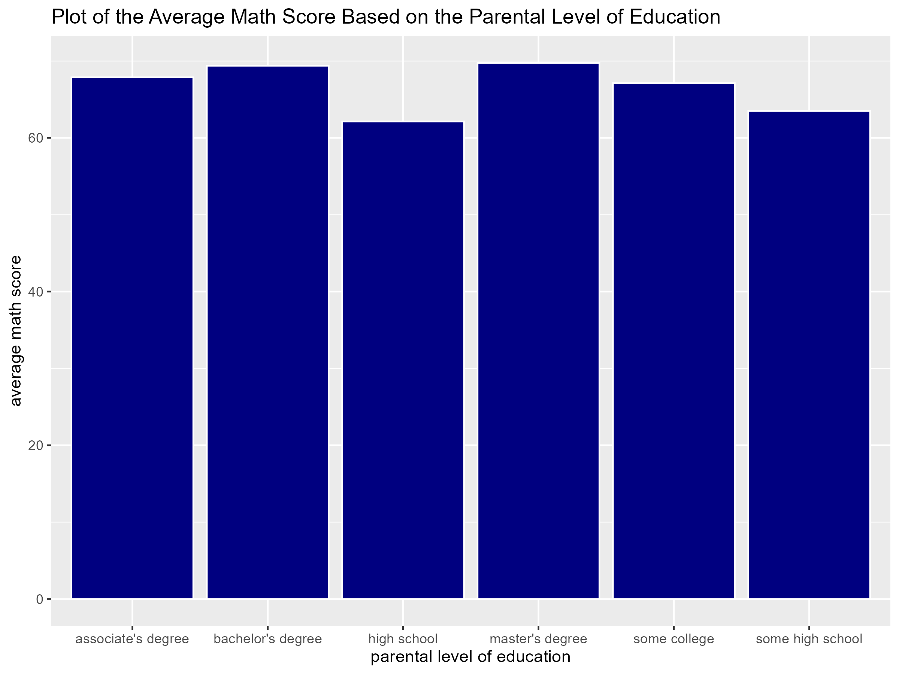
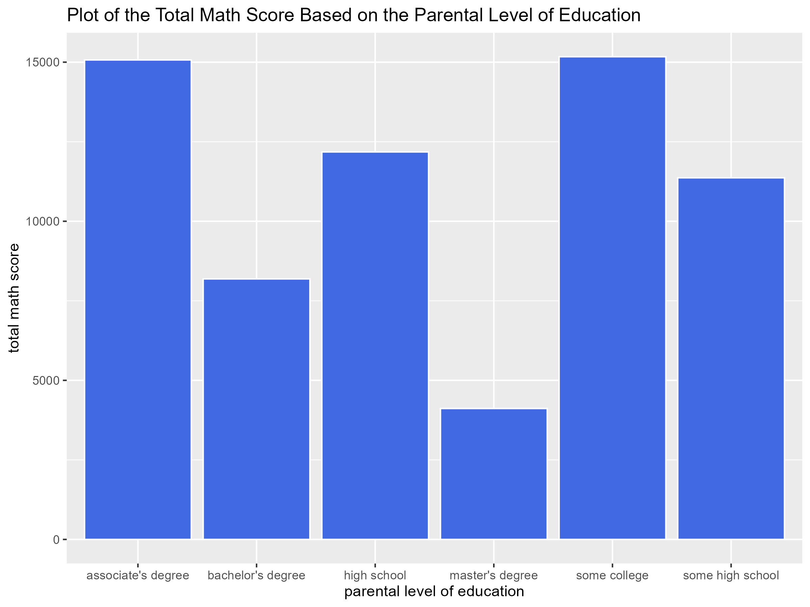
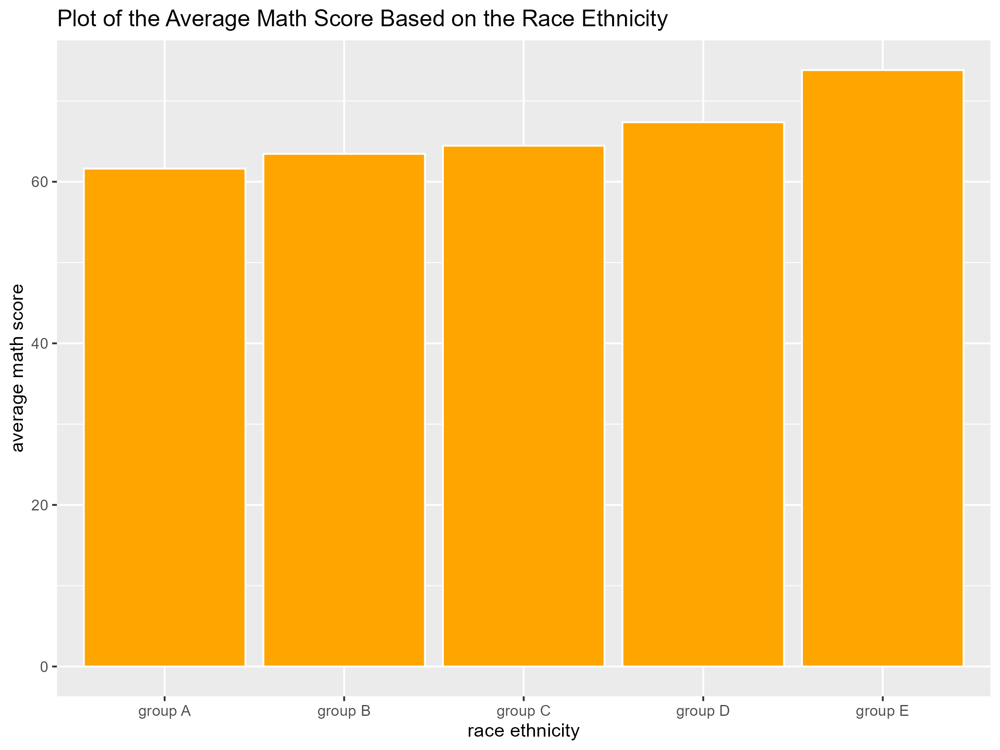
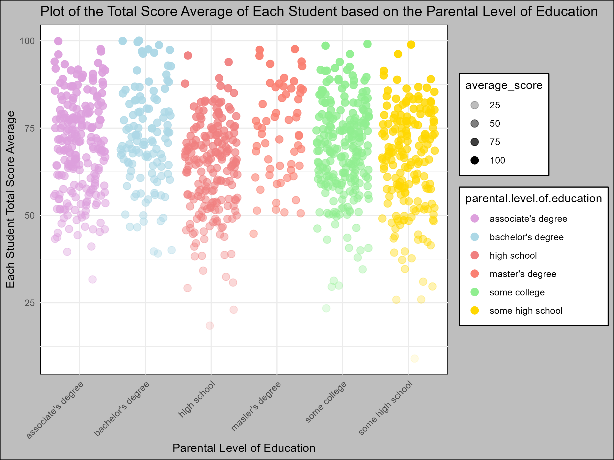
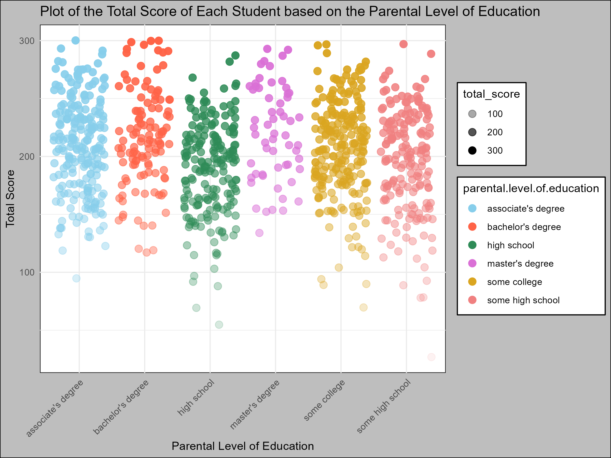

# Students Performance Analysis and Visualization Using R 📈
This repository contains the implementation of my project titled _"Students Performance Analysis and Visualization Using R"_, at the National Centre for Artificial Intelligence and Robotics (NCAIR), Nigeria.

## 📘 Step-by-step Procedure

This project was organized into three main sections, each containing tasks that guide the analysis, calculation, and visualization of student performance data using R. All tasks emphasized proper data exploration, clear commenting, and displaying intermediate results using print(), head(), or tail().

### 📂 Section 1 — Data Creation & Basic Computations

🔹 **Create the Initial DataFrame (Task 1):** This involved creating a dataframe with 9 columns and 20 rows.
The required columns are: `name (character)`, `age (numeric)`, `gender (character)`, `height (numeric)`, `weight (numeric)`, `math_score (numeric)`, `eng_score (numeric)`, `phy_score (numeric)`, and `chem_score (numeric)`.

🔹 **Compute Jamb Score (Task 2):** This involved creating a new column named `Jamb_score` which would be the sum of  the math_score, eng_score, phy_score, and chem_score.

🔹 **Compute Average Score (Task 3):** This involved creating another columns named `Average` that computes the mean of the four subject scores (from math, English, physics, chemistry).

**NOTE:** The Results for this can be assessed by accessing and running the program script [**here**](Project_1.r)

### 📂 Section 2 — Data Exploration & Visualization 

🔹 **Summary Statistics for race.ethnicity (Task 1):** This involved generating a descriptive statistics for the column `race.ethnicity`.

🔹 **Math Score Analysis by Race/Ethnicity (Task 2):** involved calculating: 

  - the average math score for each race/ethnicity group (plot required) AND 
  - Computing the deviation from the mean for each group.

🔹 **Total Score by Parental Level of Education (Task 3)**: This involved the following:
  - Computing the total score of each student based on parental education level.
  - Calculating the average total score per parental education group.
  - Computing the deviation from mean for each group (total score − group average).

**NOTE:** The Results for this can be assessed by accessing and running the program script [**here**](Project_2.r)

🔹 **Visualizations involved (Task 4):**

  - Plotting the average math score by parental level of education.
  - Plotting the total math score based on parental level of education.
  - Plot the race ethnicity average math score  

    
     
    <em> The Parent Educational Level Average Math Score Plot</em>

    
     
    <em> The Parent Educational Level Total Math Score Plot</em>

    
     
    <em> The Race Ethnicity Average Math Score Plot</em>

### 📂 Section 3 — Extended Analysis & Visualization 

This section focused on advanced visualization and deeper individual-level analysis using the Students Performance dataset.
It builds on the earlier sections by introducing new types of plots and multi-metric analysis.

🔹 Task 1 – Advanced Visualization of Total Score per Student (Jitter Plot)

- Create a new column called `total_score` which will be the  = math.score + reading.score + writing.score

- Visualize total score distribution per student using a jitter plot, where: Points are colored by parental level of education and the Jitter is applied to reduce point overlap

🔹 Task 2 – Advanced Visualization of Average Total Score per Student (Jitter Plot)

After computing total_score, create: average_score = total_score / 3 and plot the average student performance using a jitter plot grouped by parental education level after which you'd apply custom color mapping.

**NOTE:** The Results for this can be assessed by accessing and running the program script [**here**](Project_3.r)

    
     
    <em> Each Student's Total Score Average Plot</em>

    
     
    <em> Each Student's Total Plot</em>

